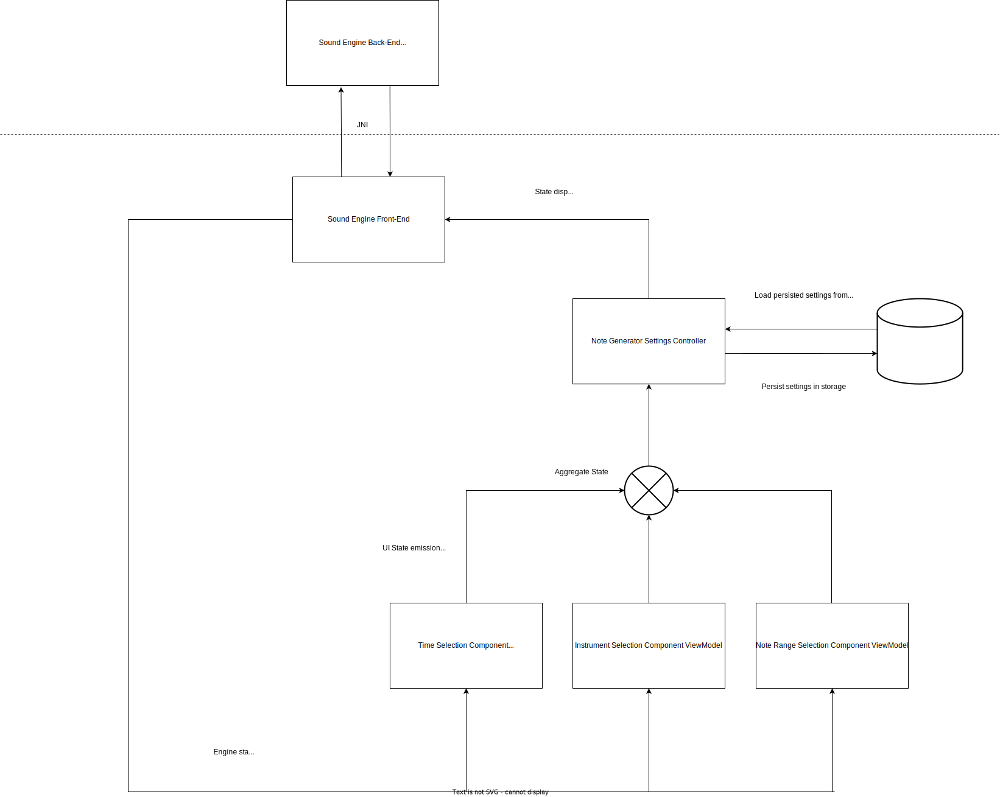

<h1 align="center">🎵 MyRandNotes 🎵 </h1>

  
  By enabling musicians to train their musical perception handsfree, MyRandNotes enhances their auditory skills and fosters a deeper understanding of chord progressions and melodic patterns. With a slick and minimalistic UI, you can easily choose which chords and octaves you want to be played, the time interval between each note and which instrument, from a vast library of over 30 instruments, ranging from classic pianos and guitars to exotic world instruments, allowing you to customize your training experience.

 

## Tech stack and libraries

- Asynchronous event/data handling with [Coroutines](https://github.com/Kotlin/kotlinx.coroutines) and [Flow](https://kotlin.github.io/kotlinx.coroutines/kotlinx-coroutines-core/kotlinx.coroutines.flow/).
- Jetpack
  - Lifecycle: Observe Android lifecycles and handle UI states upon the lifecycle changes.
  - ViewModel: Manages UI-related data holder and lifecycle aware. Allows data to survive configuration changes such as screen rotations. 
  - [Hilt](https://dagger.dev/hilt/): for dependency injection.
  - Compose: for making beautiful declaratively-made UIs.
- Architecture
  - MVVM Architecture (View - ViewModel - Model).

 
- [Fluidsynth](https://github.com/FluidSynth/fluidsynth): State-of-the-art  MIDI-based audio synthesizer open source software.
- [Moshi](https://github.com/square/moshi/): A modern JSON library for Kotlin and Java.
- NDK: Toolchain for compiling C/C++ code for multiple ABI architectures.
- JNI: Library for handling Java and C/C++ code integration.

## Architecture

Bellow follows a diagram representation of the app's architecture:

Key points from the diagram being:

* State/settings emissions and collections aided by Kotlin's Flow library.
* Note Generator Settings controller being the states' source of truth.

